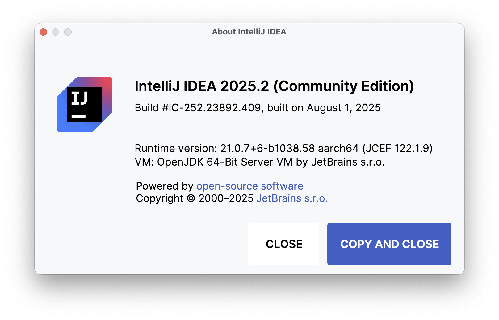

# Jet Brains IntelliJ Setup & HelloWorld

## Instructions for working in Walton Building PC Labs:

If you are working on the workstations in SETU in the IT Building, IntelliJ should already be installed so proceed with the next step of the lab.

## Instructions for working on your own PC / laptop

Download and install **IDEA Community Edition** from

 - <https://www.jetbrains.com/idea/download/>

This is the version we will be working with:

 

  
Select the correct version for your OS. The primary prerequisite for installing IntelliJ is that you have a recent Java installation on your workstation. To see if you have Java, and to install it if you do not, visit:

 - <http://www.java.com>

Jet Brains offers a lot of resources to help you get started with Kotlin here

[Getting Started](https://kotlinlang.org/docs/tutorials/getting-started.html)

and also the

# Kotlin Playground

- <https://play.kotlinlang.org/>

which I would recommend having a look at first before proceeding with this Lab, just to get some basic usage of the language.
