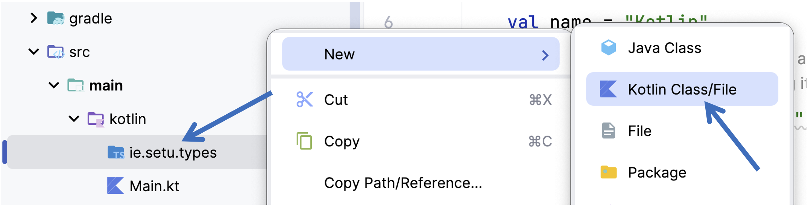
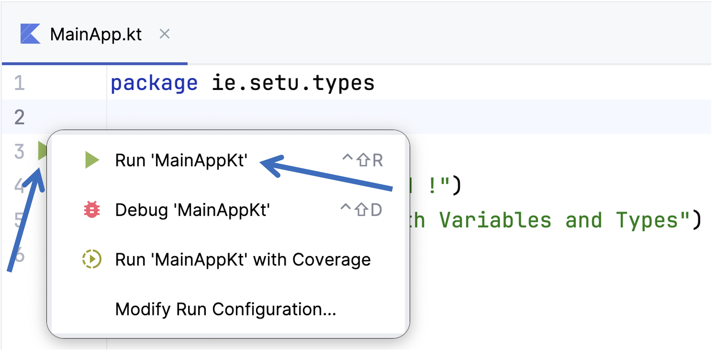

# HelloWorld with 'Types'

## Kotlin has two keywords used to declare variables, **val** and **var**:

- **val** creates an immutable declaration. Use this keyword when the value of the declaration won't change once set.  Use this one whenever possible.
- **var** is used for a mutable declaration i.e. the value can change.

In this project, we will familiarise ourselves with creating variables, Kotlin types and type inference

# New Project in IntelliJ

In IntelliJ, create a new project (Version numbers may differ).  

Use the following credentials for your new project:

Name your Project **Types** and ensure that the chosen location for your project is ok:

Choose **Kotlin** as the Language and **Gradle** for the Build System.

We're also choosing to `Add sample code` here

Note, if you have 'No JDK' in the 'Project JDK' list (here we have OpenJDK 23), you can select from the installed JDK's on your machine.

If that list is empty, you will need to 'Download' and/or 'Add' a JDK.

When you select **'Create'** your default project will load, something like below:

Next, within the **main/kotlin** folder, create a new **package** ***ie.setu.types*** (using Right Mouse Click RMC)

and

Within that package create a new `Kotlin Class/File` (RMC again)

choose **File** and name it **MainApp**, as follows:

When the window appears enter the following code into this new file:

~~~kotlin
fun main(){
  println("Hello World !")
  println("Working with Variables and Types")
}
~~~

so you have something like this:

...and then run it.  

**NOTE : the package statement may have updated to `package org.example.ie.setu.types` so make sure it is as above.**

The easiest way to do this is select the `Play/Run` button in the gutter (on the left hand side, as in the above screenshot)

You should have the following output:

We are now ready to start experimenting with variables and types.

# Basic Types (no type inference)

**In this section, we would advise typing in the supplied code so you can familiarise yourself with the Kotlin syntax.**

The following code explicitly defines the type for 6 different immutable variables.  Type (or cut & paste if you wish) this code into your **main** function:

~~~kotlin
    val doubleNumber: Double = 1200.45
    val floatNumber: Float = 700.78f
    val longNumber: Long = 98765432
    val intNumber: Int = 123456
    val shortNumber: Short = 345
    val byteNumber: Byte = 127
~~~

And then add the following lines of code, after the existing ***println*** statements:

~~~kotlin
    println("doubleNumber value is: " + doubleNumber + ", and the type is: " + doubleNumber.javaClass)
    println("floatNumber value is:  " + floatNumber + ", and the type is: " + floatNumber.javaClass)
    println("longNumber value is:   " + longNumber + ", and the type is: " + longNumber.javaClass)
    println("intNumber value is:    " + intNumber + ", and the type is: " + intNumber.javaClass)
    println("shortNumber value is:  " + shortNumber + ", and the type is: " + shortNumber.javaClass)
    println("byteNumber value is:   " + byteNumber + ", and the type is: " + byteNumber.javaClass)
~~~

Run the code, (you can also now use the toolbar `Play/Run` option)

You can clearly see that the kotlin type matches with the Java primitive type, which matches with the explicitly declared type: 

# Basic Types (with type inference)

Now remove the type declaration from the above code (we will now infer the type from the value supplied at variable declaration time) i.e.:

~~~kotlin
    val doubleNumber = 1200.45
    val floatNumber = 700.78f
    val longNumber = 98765432
    val intNumber = 123456
    val shortNumber = 345
    val byteNumber = 127
~~~

Run the code again and note the new inferred types...can you now see what the purpose of the **`f`** is in the value for floatNumber: (I've removed the basic 'Hello World' println statement here also)

Update the definition for the *longNumber* variable to be:

~~~kotlin
    val longNumber = 98765432L
~~~

And run the code again.  Verify that the inferred type is now **`long`**.

## Values with Underscores

You can use underscores in numbers to make the values in your code more readable.  The underscores do not affect the value at all.  Try this code in your main function:

~~~kotlin
    println("\nUsing underscores to make values more readable:")
    val oneMillion = 1_000_000
    val threeThousand = 3_000
    val creditCardNumber = 1234_4321_5678_8765

    println("\t" + oneMillion + " - the type is: " + oneMillion.javaClass)
    println("\t" + threeThousand + " - the type is: " + threeThousand.javaClass)
    println("\t" + creditCardNumber + " - the type is: " + creditCardNumber.javaClass)
~~~

When you run it,

note how the value printed excludes the underscores.  Also note the inferred type for each variable.  Why do you think `long` was selected instead of int for the variable *creditCardNumber*.

Save your work...we will continue working on this project in the next step!
