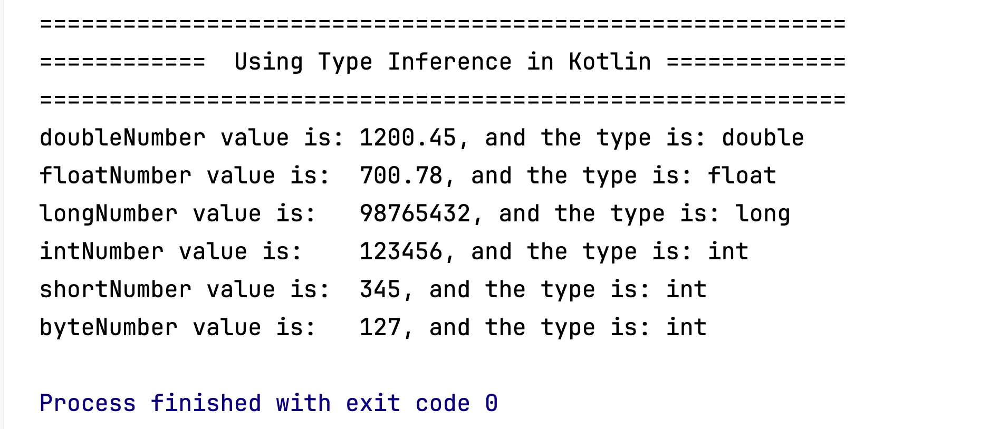
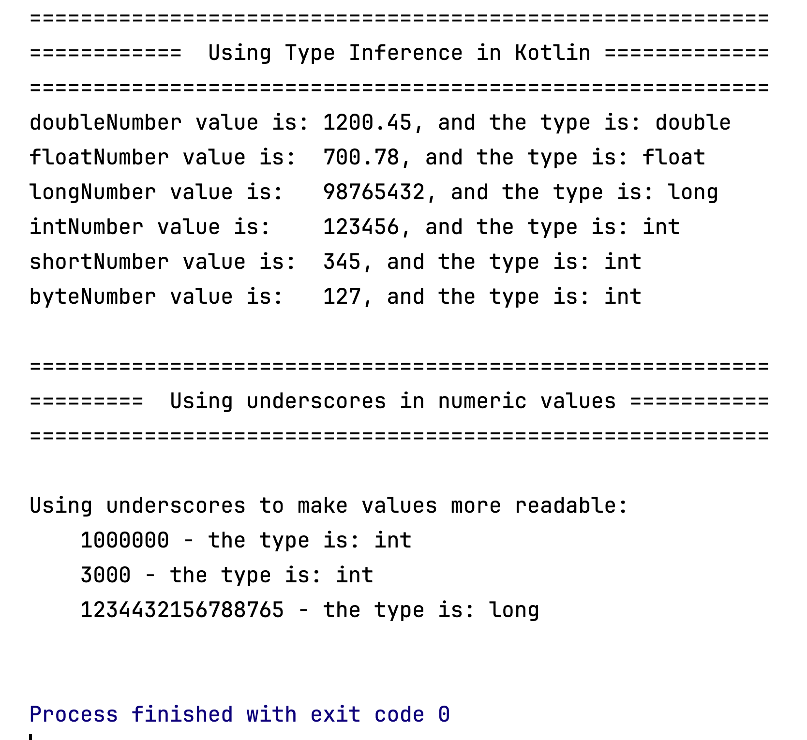
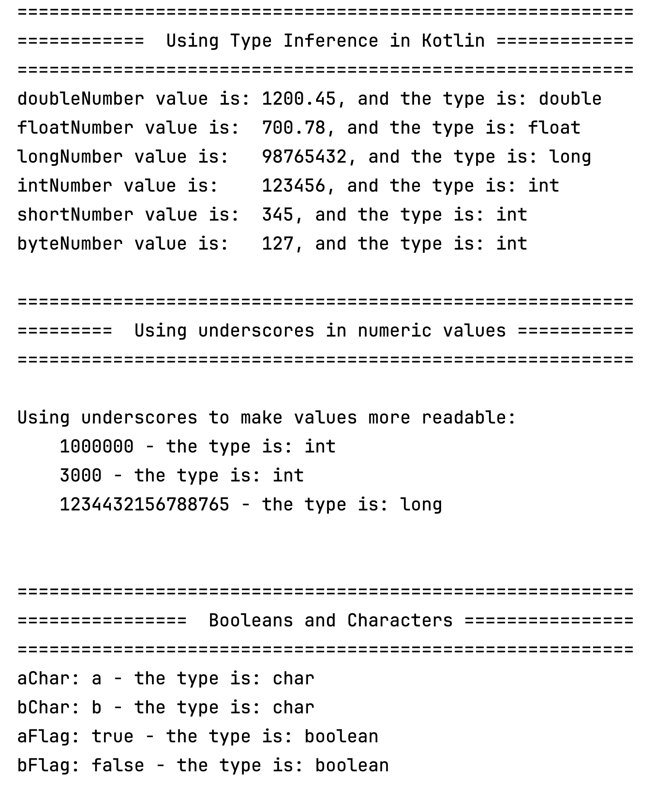

# functions (without parameters)

We will continue working in the **Types** project from the previous steps.

Having worked though this lab, your main function will be quite large e.g. you will have something similar to this:

~~~java
fun main() {

    println("Working with Variables and Types")

    //Variables in kotlin and their types

    val doubleNumber = 1200.45
    val floatNumber = 700.78f
    val longNumber = 98765432L
    val intNumber = 123456
    val shortNumber = 345
    val byteNumber = 127

    println("doubleNumber value is: " + doubleNumber + ", and the type is: " + doubleNumber.javaClass)
    println("floatNumber value is:  " + floatNumber + ", and the type is: " + floatNumber.javaClass)
    println("longNumber value is:   " + longNumber + ", and the type is: " + longNumber.javaClass)
    println("intNumber value is:    " + intNumber + ", and the type is: " + intNumber.javaClass)
    println("shortNumber value is:  " + shortNumber + ", and the type is: " + shortNumber.javaClass)
    println("byteNumber value is:   " + byteNumber + ", and the type is: " + byteNumber.javaClass)

    //underscores make number values more readable in code

    println("\nUsing underscores to make values more readable:")
    val oneMillion = 1_000_000
    val threeThousand = 3_000
    val creditCardNumber = 1234_4321_5678_8765

    println("\t" + oneMillion + " - the type is: " + oneMillion.javaClass)
    println("\t" + threeThousand + " - the type is: " + threeThousand.javaClass)
    println("\t" + creditCardNumber + " - the type is: " + creditCardNumber.javaClass)

    //explicit conversion of value

    val byteNum: Byte = 10              //static type check: OK
    val intNum: Int = byteNum.toInt()   //explicit conversion: OK
    val floatNum: Float = byteNum.toFloat()
    val doubleNum: Double = intNum.toDouble()

    //characters in kotlin
    val aChar = 'a'			//type inference
    val bChar: Char = 'b'   //explicitly defining the type

    println("aChar: " + aChar + " - the type is: " + aChar.javaClass)
    println("bChar: " + bChar + " - the type is: " + bChar.javaClass)

    //booleans in kotlin
    val aFlag = true
    val bFlag: Boolean = false

    println("aFlag: " + aFlag + " - the type is: " + aFlag.javaClass)
    println("bFlag: " + bFlag + " - the type is: " + bFlag.javaClass)

    //mutable variables
    var number = 5   //Int type is inferred
    number ++;       //mathematical operations are allowed
    println("number: " + number)
    number = 3;       //Allowed to reassign a var too
    println("number: " + number)

}
~~~

In this and the following step, we are going to create new functions in **MainApp.kt**, some of which take parameters and some of which don't.  

## Factory Reset !!

Delete all the statements in your ***fun main***, but leave the function declaration i.e. :

~~~java
fun main() {

}
~~~

## Your First function without parameters

First, we will add a new function called *typeInference* that doesn't take any parameters...type this code and make sure it is **OUTSIDE** of your `main()` function :

~~~java
fun typeInference() {

}
~~~

Then cut and paste the following code into this function:

~~~java
    println ("\n==========================================================")
    println ("============  Using Type Inference in Kotlin =============")
    println ("==========================================================")

    val doubleNumber = 1200.45
    val floatNumber = 700.78f
    val longNumber = 98765432L
    val intNumber = 123456
    val shortNumber = 345
    val byteNumber = 127

    println("doubleNumber value is: " + doubleNumber + ", and the type is: " + doubleNumber.javaClass)
    println("floatNumber value is:  " + floatNumber + ", and the type is: " + floatNumber.javaClass)
    println("longNumber value is:   " + longNumber + ", and the type is: " + longNumber.javaClass)
    println("intNumber value is:    " + intNumber + ", and the type is: " + intNumber.javaClass)
    println("shortNumber value is:  " + shortNumber + ", and the type is: " + shortNumber.javaClass)
    println("byteNumber value is:   " + byteNumber + ", and the type is: " + byteNumber.javaClass)
~~~

Now let's call this new function from INSIDE the `main()` function:

~~~java
fun main() {
    typeInference()
}
~~~

Run the code...you should get output similar to this:

## Another function that doesn't take parameters

Add another function called *usingUnderscores* that doesn't take any parameters.

Then cut and paste the following code into this function:

~~~kotlin
    println ("\n==========================================================")
    println ("=========  Using underscores in numeric values ===========")
    println ("==========================================================")

    //underscores make number values more readable in code

    println("\nUsing underscores to make values more readable:")
    val oneMillion = 1_000_000
    val threeThousand = 3_000
    val creditCardNumber = 1234_4321_5678_8765

    println("\t" + oneMillion + " - the type is: " + oneMillion.javaClass)
    println("\t" + threeThousand + " - the type is: " + threeThousand.javaClass)
    println("\t" + creditCardNumber + " - the type is: " + creditCardNumber.javaClass)
    println()
~~~

And call this new function from the `main()` function.

Run the code... you should now get output similar to this:

## Another function that doesn't take parameters

Add a third function called *booleansAndCharacters* that doesn't take any parameters.

Then cut and paste the following code into this function:

~~~java
    println ("\n==========================================================")
    println ("================  Booleans and Characters ================")
    println ("==========================================================")

    //characters in kotlin
    val aChar = 'a'            //type inference
    val bChar: Char = 'b'   //explicitly defining the type
    println("aChar: " + aChar + " - the type is: " + aChar.javaClass)
    println("bChar: " + bChar + " - the type is: " + bChar.javaClass)

    //booleans in kotlin
    val aFlag = true
    val bFlag: Boolean = false
    println("aFlag: " + aFlag + " - the type is: " + aFlag.javaClass)
    println("bFlag: " + bFlag + " - the type is: " + bFlag.javaClass)

    println()
~~~

And again, call this new function from the `main()` function.

Run the code... you should get output similar to this:

Save your code.  In the next step, we will look at adding functions that take parameters.
