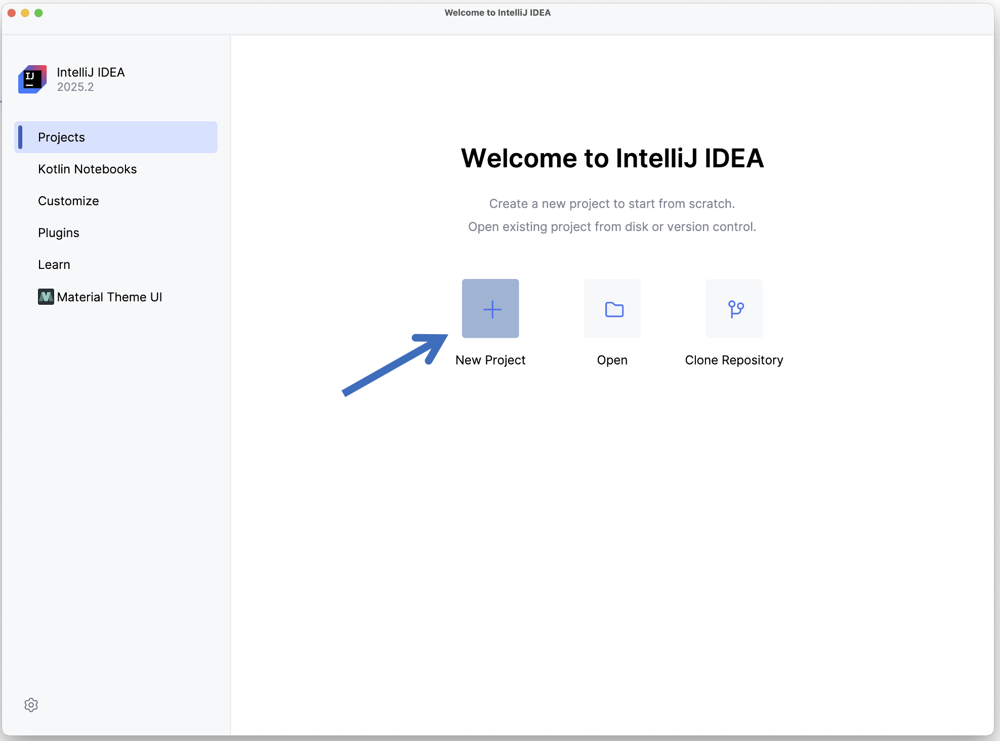
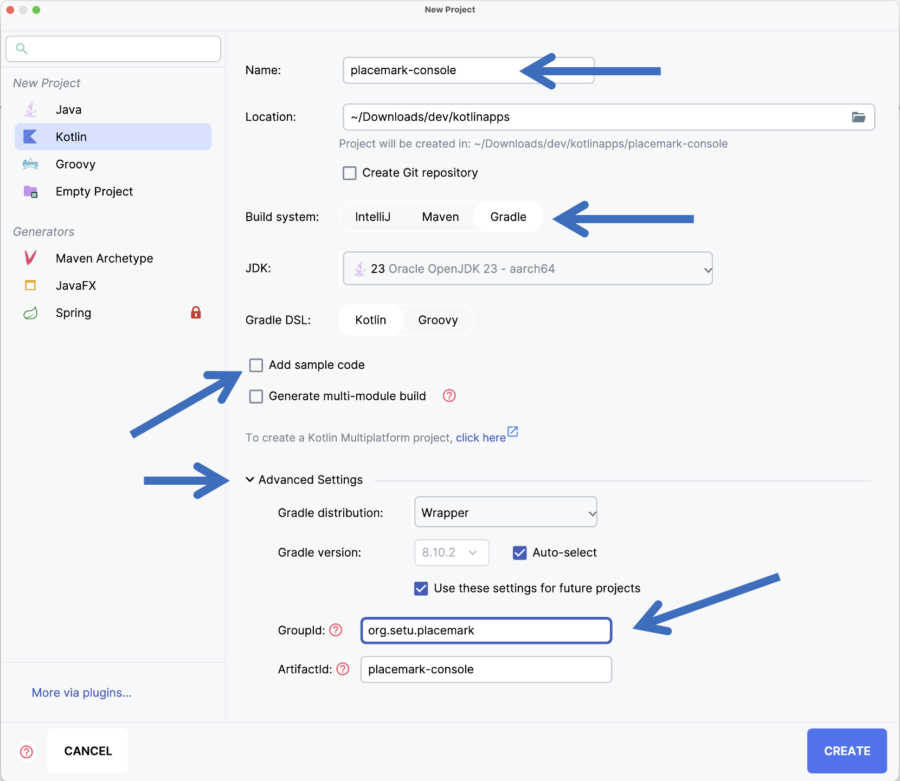
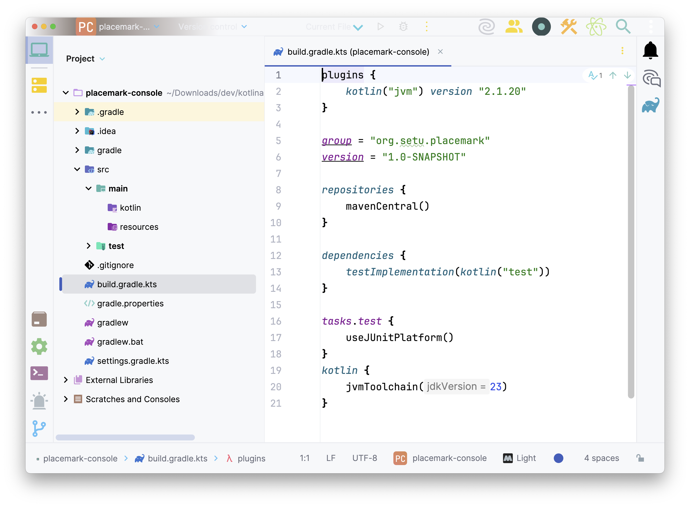
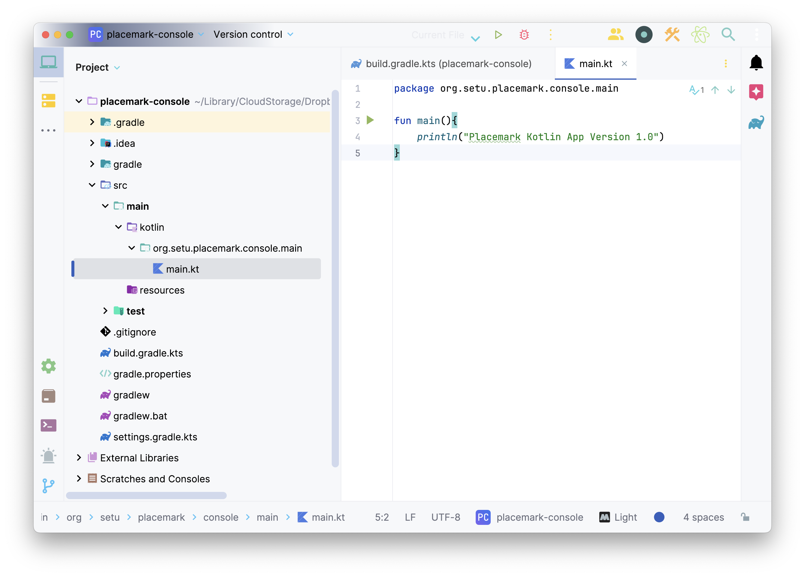
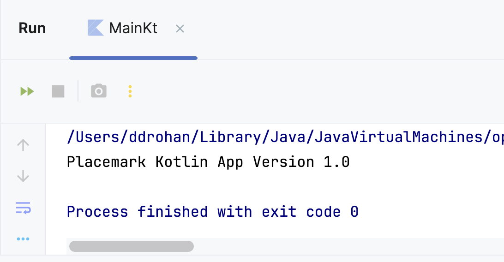

# Placemark-Console 1.0

## New Project in IntelliJ

Open IntelliJ and from the Welcome to IntelliJ IDE screen, choose `+ New Project`.

On the **New Project** screen, choose the same settings as the previous lab, DON'T `Add sample code`, name your project **`placemark-console`** and in `Advanced Settings` set the GroupId to `org.setu.placemark`. Finally, click the ***Create*** button:

Gradle will start downloading required dependencies.  When this is finished, you should have the following project structure:

## Kotlin **`main`** Function

Similar to previous labs, create a new package **`org.setu.placemark.console.main`** inside the `Kotlin` folder and add a new **`Kotlin File`** called **`main`** inside that package

Enter the following code into this new `main` file:

~~~kotlin
fun main(){
    println("Placemark Kotlin App Version 1.0")
}
~~~

Your project should now look something like this

Now Run/Play the app.

You should have the following output:

Save your work.
