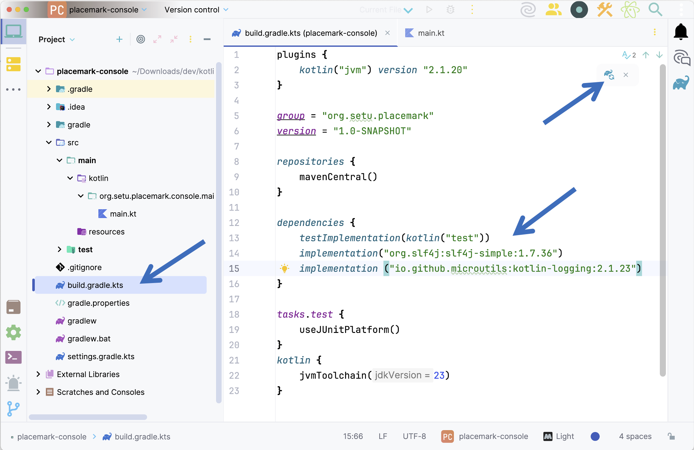
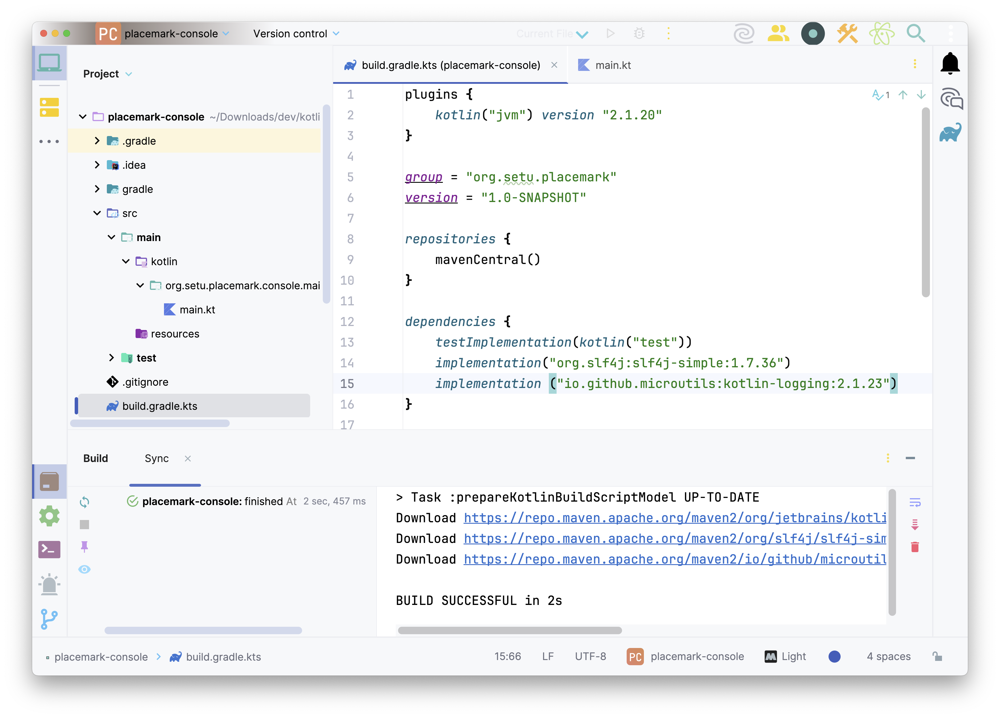
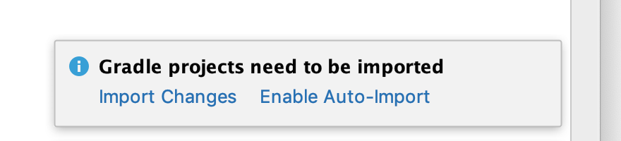
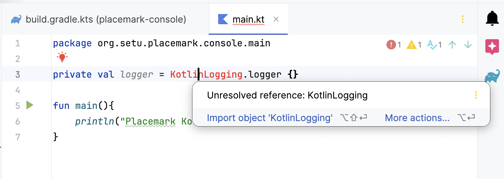
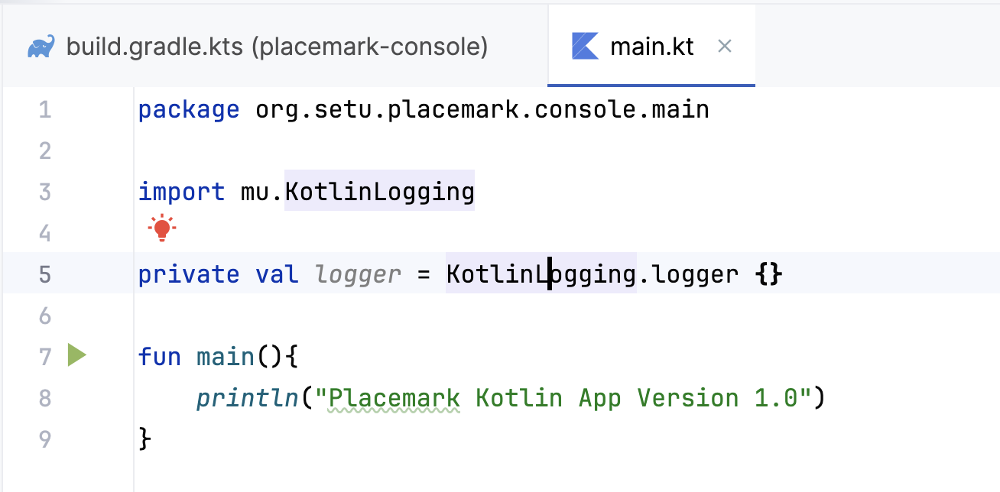
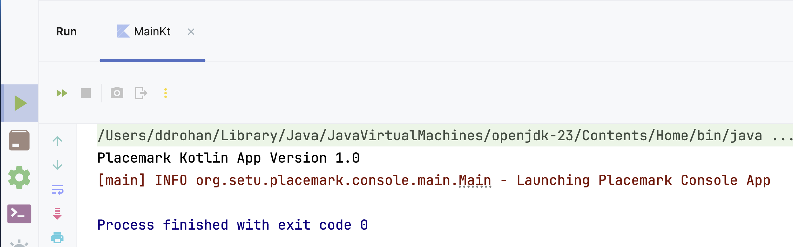

# Adding Logging Support

In Kotlin, as opposed to Java, there is no established standard when it comes to logging. JetBrains didn’t provide any opinionated way. There are few different approaches that allow developers to do it properly but we're going to use [`kotlin-logging`](https://github.com/MicroUtils/kotlin-logging) - a lightweight logging framework for Kotlin, written in Pure Kotlin. It's a convenient and performant logging library wrapping *slf4j* with *Kotlin* extensions.

So first of all, open your `build.gradle.kts` and add the following dependencies (version numbers may differ, so upgrade if prompted) **AND** make sure you 'sync' your gradle file (top right arrow in screenshot)

~~~java
implementation("org.slf4j:slf4j-simple:1.7.36")
implementation ("io.github.microutils:kotlin-logging:2.1.23")
~~~

After 'sync' (and the 'Build' Window open)

Note: if you get the following message when importing

Choose **Enable Auto-Import** (will make life a lot easier!)

Next, open your `main.kt` and add the following ***before*** your ***main*** function (and fix any import errors)

~~~kotlin
private val logger = KotlinLogging.logger {}
~~~

and

Now add the following to where you think is most appropriate to achieve the output below

~~~java
 logger.info { "Launching Placemark Console App" }
~~~

Run your app again and you should get something like this

Congratulations - you've just added logging support to your Kotlin project :)
