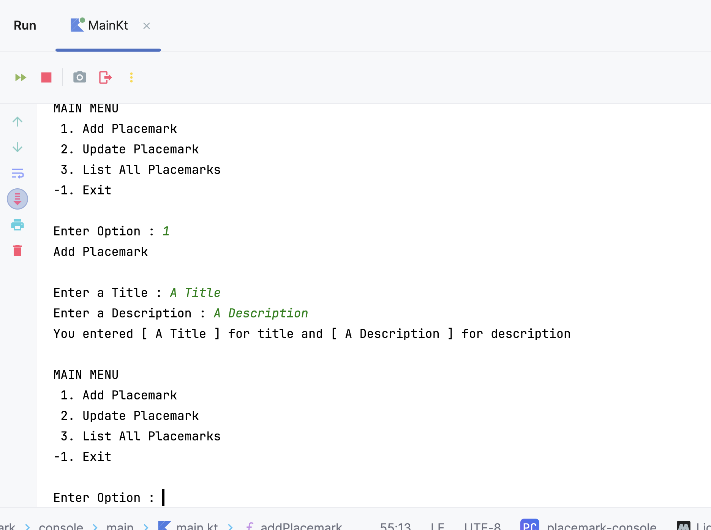
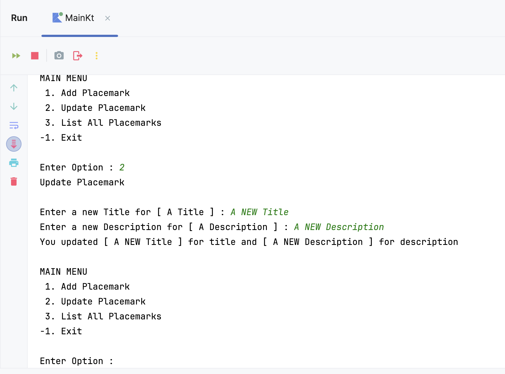

# Managing Placemark Data

## Adding a Placemark
To allow the user to add and update a **Placemark** we need to get certain data input from the user, namely a `title` and a `description`, so for the moment go ahead and replace your current `addPlacemark()` with the following

~~~kotlin
fun addPlacemark(){
    var title : String

    println("Add Placemark")
    println()
    print("Enter a Title : ")
    title = readLine()!!
    println("You entered $title for title")
}
~~~

Run your app and confirm you can display the entered `title` back to the user and then implement the additional code necessary to also get the `description` so you get the following displayed to the user

Next, move your declarations for `title` and `description` properties **above** your `main` function (to make them global). We need to do this so we can 'update' whatever data the user originally enters and not a local copy (as is currently the case).

Run your app again to confirm it still works as expected, now that you're using global properties.

## Updating a Placemark

This is very similar to our `addPlacemark` so have a go at that too and it would be useful to prompt the user with the previous value of the data when they choose to update it, like so

This is all well and good for managing a single Placemark, but what happens if the user wants to add a new Placemark, and keep the original one - this is where `Classes`, `Objects` and `Collections` help us (and we'll use these in the next few steps).

For Reference, here's our *`main.kt`* so far

~~~kotlin
package org.setu.placemark.console.main

import mu.KotlinLogging

private val logger = KotlinLogging.logger {}

var title = ""
var description = ""

fun main() {
    logger.info { "Launching Placemark Console App" }
    println("Placemark Kotlin App Version 2.0")

    var input: Int

    do {
        input = menu()
        when(input) {
            1 -> addPlacemark()
            2 -> updatePlacemark()
            3 -> listPlacemarks()
            -1 -> println("Exiting App")
            else -> println("Invalid Option")
        }
        println()
    } while (input != -1)
    logger.info { "Shutting Down Placemark Console App" }
}

fun menu() : Int {

    var option : Int
    var input: String?

    println("MAIN MENU")
    println(" 1. Add Placemark")
    println(" 2. Update Placemark")
    println(" 3. List All Placemarks")
    println("-1. Exit")
    println()
    print("Enter Option : ")
    input = readLine()!!
    option = if (input.toIntOrNull() != null && !input.isEmpty())
        input.toInt()
    else
        -9
    return option
}

fun addPlacemark(){

    println("Add Placemark")
    println()
    print("Enter a Title : ")
    title = readLine()!!
    print("Enter a Description : ")
    description = readLine()!!
    println("You entered [ $title ] for title and [ $description ] for description")
}

fun updatePlacemark() {
    println("Update Placemark")
    println()
    print("Enter a new Title for [ $title ] : ")
    title = readLine()!!
    print("Enter a new Description for [ $description ] : ")
    description = readLine()!!
    println("You updated [ $title ] for title and [ $description ] for description")
}

fun listPlacemarks() {
    println("You Chose List All Placemarks")
}
~~~
