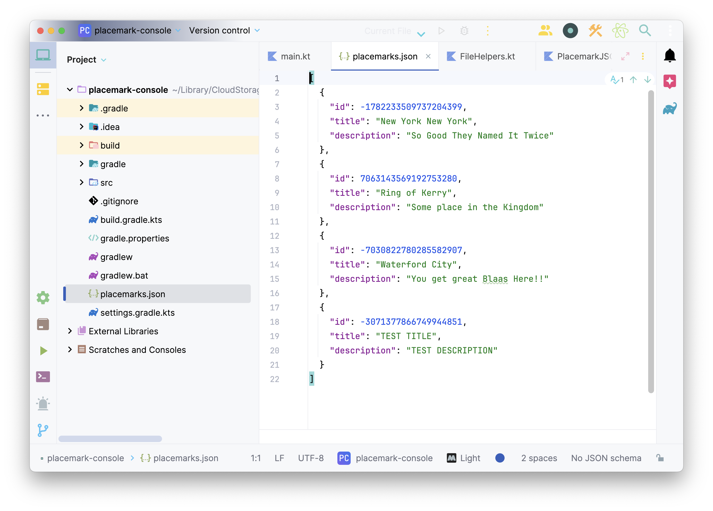
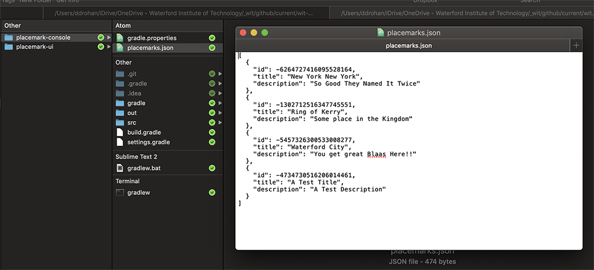

# Switching Stores

To use the new store, we just need to switch it in the Controller:

## PlacemarkController

~~~kotlin
class PlacemarkController {

    // val placemarks = PlacemarkMemStore()

    val placemarks = PlacemarkJSONStore()

    val placemarkView = PlacemarkView()
    val logger = KotlinLogging.logger {}

    . . .
}
~~~

and update our PlacemarkView `listPlacemarks` like so...

~~~kotlin
fun listPlacemarks(placemarks : PlacemarkJSONStore) {  
    println("List All Placemarks")  
    println()  
    placemarks.logAll()  
    println()  
}
~~~

**No other changes should be necessary!**

Run the app now - and verify that you can create placemarks. Terminate the app, and see if the placemarks are still there when you relaunch the app.

Here you can view it in the project window.

Finally, locate the actual file in your local storage (I'm on a Mac here):

