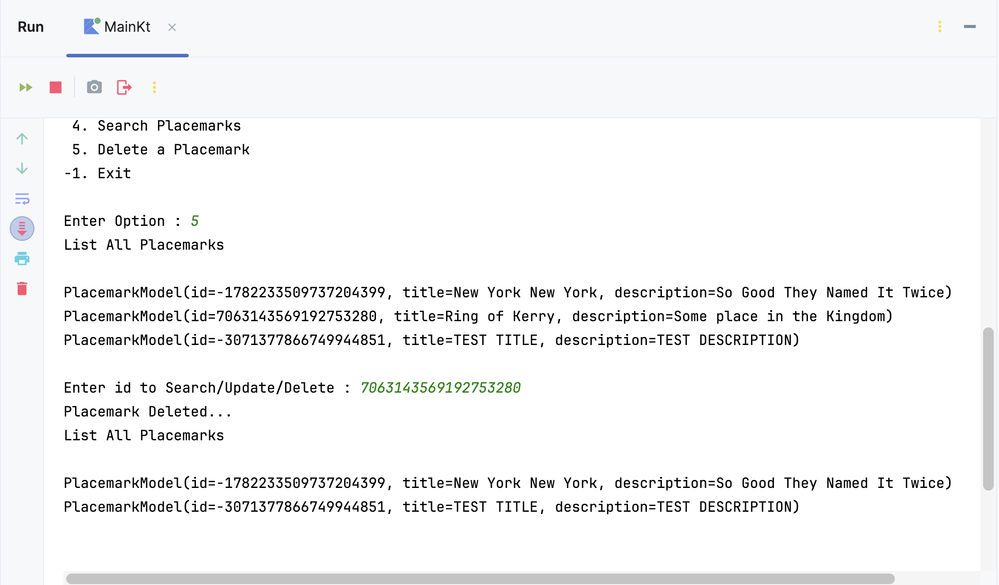

# Exercises

Here's a version of the completed solution so far (without the Exercises) : [placemark-console](archives/placemark-console04.zip)

## Exercise 

Currently we have no way of deleting placemarks. To support delete, you will need to extend the `PlacemarkStore` to support removal of placemarks, and then implement this in `PlacemarkMemStore` and `PlacemarkJSONStore`

These are the implementations you will need:

**PlacemarkStore**
~~~kotlin
  fun delete(placemark: PlacemarkModel)
~~~
Introduce this to `PlacemarkStore` now - and write implementations in `PlacemarkMemStore` and `PlacemarkJSONStore` classes :

**PlacemarkMemStore**
~~~kotlin
  override fun delete(placemark: PlacemarkModel) {
    placemarks.remove(placemark)
  }
~~~

**PlacemarkJSONStore**
~~~kotlin
  override fun delete(placemark: PlacemarkModel) {
    placemarks.remove(placemark)
    serialize()
  }
~~~
To trigger the deletion introduce a new **delete** option in the menu, something like this

and add the following to `PlacemarkController` to actually delete the placemark from the list (or file)

~~~kotlin
fun delete() {
        placemarkView.listPlacemarks(placemarks)
        var searchId = placemarkView.getId()
        val aPlacemark = search(searchId)

        if(aPlacemark != null) {
            placemarks.delete(aPlacemark)
            println("Placemark Deleted...")
            placemarkView.listPlacemarks(placemarks)
        }
        else
            println("Placemark Not Deleted...")
    }
~~~

**NOTE: I found using the logging for output a bit 'buggy' so I've updated it to use a simple println for listing and you can find the full project below:**

- [placemark-console.zip](archives/placemark-console04-we.zip)

Well Done :)
